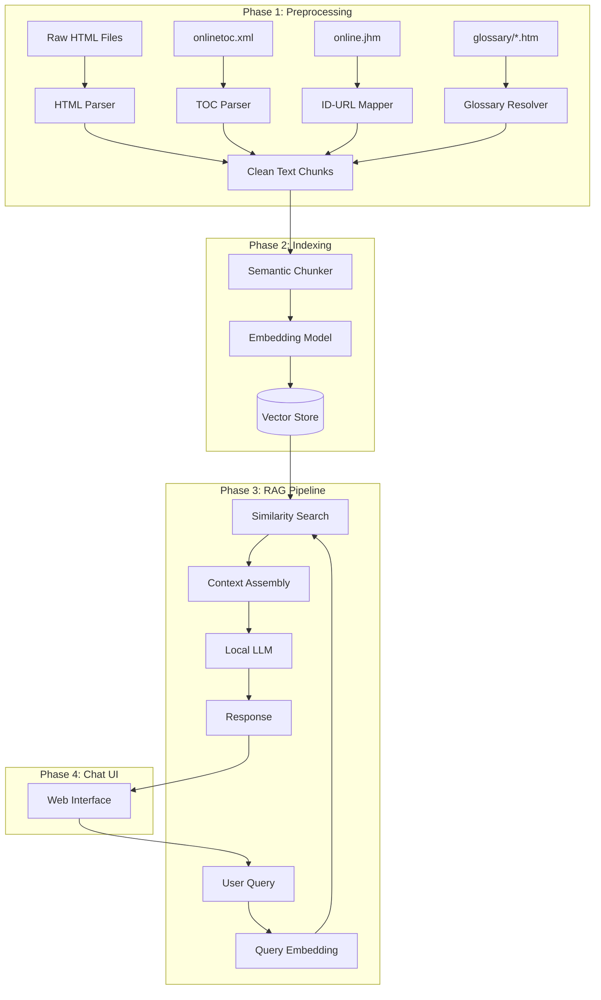

# 🤖 Siemens SPPA-T3000 RAG Chatbot — Implementation Plan

---

## 1. Data Analysis Summary

After a thorough analysis of `c:\Users\sgpan\siemens-rag\help_en_US\help_en_US`, here is what we're working with:

### Documentation Structure

| Component | Details |
|---|---|
| **Product** | Siemens SPPA-T3000 (Power Plant Automation) |
| **Format** | JavaHelp system (.hs, .jhm, .xml TOC) |
| **Online Help Files** | **4,046** `.htm` files in `online/` (~104 MB) |
| **Context Help Files** | **3,024** `.htm` files in `help/` |
| **Glossary Files** | **367** `.htm` files in `glossary/` (short definitions, ~200-500 bytes each) |
| **TOC Structure** | `onlinetoc.xml` — 3,898 lines, deep hierarchical tree |
| **ID-to-URL Map** | `online.jhm` — maps target IDs (e.g., `"20.10.50.20"`) → file paths (e.g., `online/en_20.10.50.20.htm`) |
| **Help ID Properties** | `HelpIDs.properties` (222 KB), `AF_HelpIDs.properties` (70 KB), plus domain-specific `.properties` files |
| **Images** | `Pictures/` directory (referenced in HTML) |
| **Total Volume** | ~7,000+ HTML files, ~105 MB of text content |

### HTML Content Characteristics

- **Inline styling** — No external CSS classes for semantic extraction; all styles are inline (`font-size: 12pt; margin-left: 30pt;`)
- **JavaHelp widgets** — Glossary popup links are embedded as `<object CLASSID="java:com.sun.java.help.impl.JHSecondaryViewer">` with `<param>` tags referencing glossary HTML files
- **Metadata tags** — Each file has `<meta name="nodeid">`, `<meta name="root-element">`, `<meta name="y.io.id">` tags useful for identification
- **Navigation chrome** — Previous/next buttons with `` tags at top and bottom of each page
- **Cross-references** — Internal links between pages using `<a href="en_XX.XX.htm">` patterns
- **Export markings** — Footer contains `AL:N ECCN:N` export control classifications
- **`help/` vs `online/`** — `help/` files contain step-by-step procedures (with suffixes like `a`, `b`, `c`); `online/` files contain conceptual/reference content

### Documentation Sections (from TOC)

```
SPPA-T3000
├── Welcome (990)
├── Documentation User Guide (3.x)
├── Engineering User Guide (20.x) ← Largest section
│   ├── Getting Started (20.10.x)
│   ├── Portal, Workbench (20.20-20.30)
│   ├── Project View (20.40.x)
│   ├── Diagram Editor (20.70.x)
│   ├── Plant Display Hierarchy (20.50.x)
│   ├── Report Designer (20.80.x)
│   └── ETS, Field Devices, etc.
├── Operation User Guide (30.x)
├── Library (40.x) — Automation Functions
├── Diagnostic System (50.x)
├── System Management (80.x)
├── Connectivity Products (100.x)
├── Glossary (150.x)
└── Equipment (200.x)
```

---

## 2. Architecture Overview



---

## 3. Phase 1 — Preprocessing Pipeline

### 3.1 Project Setup

```
siemens-rag/
├── help_en_US/              # Source data (existing)
├── src/
│   ├── preprocessing/
│   │   ├── __init__.py
│   │   ├── html_parser.py       # Extract text from HTML
│   │   ├── toc_parser.py        # Parse onlinetoc.xml hierarchy
│   │   ├── jhm_mapper.py        # Parse online.jhm ID→URL map
│   │   ├── glossary_resolver.py # Inline glossary definitions
│   │   └── chunker.py           # Semantic chunking with TOC context
│   ├── indexing/
│   │   ├── __init__.py
│   │   ├── embedder.py          # Generate embeddings
│   │   └── vector_store.py      # ChromaDB/FAISS operations
│   ├── rag/
│   │   ├── __init__.py
│   │   ├── retriever.py         # Query + retrieve
│   │   └── generator.py         # LLM response generation
│   └── app/
│       ├── __init__.py
│       └── chat_ui.py           # Gradio/Streamlit frontend
├── data/
│   ├── processed/               # Cleaned text output
│   └── vectordb/                # Persisted vector store
├── config.py                    # All configuration
├── requirements.txt
├── run_preprocessing.py         # Step 1: Process docs
├── run_indexing.py              # Step 2: Build index
└── run_chat.py                  # Step 3: Launch chatbot
```

### 3.2 HTML Parser (`html_parser.py`)

**Goal:** Extract clean, readable text from every `.htm` file while preserving semantic structure.

**Key operations:**
1. **Strip navigation chrome** — Remove prev/next `` button rows (identified by `class="PosPrevNext"`)
2. **Strip export markings** — Remove `AL:N ECCN:N` footer tables
3. **Resolve glossary popups** — Replace `<object CLASSID="java:...JHSecondaryViewer">` blocks with the plain text value from their `<param name="text">` tag, optionally appending the glossary definition from the referenced glossary file
4. **Preserve heading hierarchy** — Convert `<h1>`, `<h2>`, `<h3>` tags to markdown-style `#`, `##`, `###`
5. **Preserve lists** — Convert `<ul>/<ol>/<li>` to bullet/numbered lists
6. **Extract title** — From `<title>` tag
7. **Extract node ID** — From `<meta name="nodeid">`
8. **Handle tables** — Convert HTML tables to markdown tables or plain text

**Library:** `BeautifulSoup4` with `lxml` parser

```python
# Pseudocode for parser
def parse_html(filepath: str) -> Document:
    soup = BeautifulSoup(html, 'lxml')
    
    # Extract metadata
    title = soup.title.string
    node_id = soup.find('meta', attrs={'name': 'nodeid'})['content']
    
    # Remove navigation elements
    for nav in soup.find_all('p', class_='PosPrevNext'):
        nav.decompose()
    
    # Remove export control footer
    for table in soup.find_all('table'):
        if 'ECCN' in table.get_text():
            table.decompose()
    
    # Resolve JavaHelp glossary popups
    for obj in soup.find_all('object'):
        text_param = obj.find('param', attrs={'name': 'text'})
        if text_param:
            obj.replace_with(text_param['value'])
    
    # Extract clean text with structure
    text = extract_structured_text(soup.body)
    
    return Document(
        text=text,
        metadata={
            'node_id': node_id,
            'title': title,
            'source_file': filepath,
            'section_path': '',  # filled by TOC parser
        }
    )
```

### 3.3 TOC Parser (`toc_parser.py`)

**Goal:** Build a hierarchical breadcrumb path for every document to provide context.

Parse `onlinetoc.xml` to create a mapping like:
```
"20.10.50.20" → "SPPA-T3000 > Engineering User Guide > Getting Started > Working with Diagrams > Working with Function Diagrams"
```

This breadcrumb is **critically important** — it provides section context that helps the LLM understand *where* a chunk belongs in the documentation hierarchy.

### 3.4 Glossary Resolver (`glossary_resolver.py`)

**Goal:** Build a lookup dictionary from the 367 glossary files.

Each glossary file (e.g., `FCB9EF9019DEAC5377532C3824C3061C.htm`) contains a single short definition:
```
"A Web Browser is a program used to access and view web pages."
```

Build a map: `{hash_filename: definition_text}` so the HTML parser can optionally enrich content with inline definitions.

### 3.5 Semantic Chunker (`chunker.py`)

**Goal:** Split documents into chunks optimized for retrieval.

**Strategy — TOC-Aware Chunking:**

1. **Primary unit = one HTML file** — Since each file is already a topical unit (avg ~2-4 KB of text), many files can be treated as a single chunk
2. **Large files** — Files over ~1,500 tokens get split at heading boundaries (`<h2>`, `<h3>`) or paragraph breaks
3. **Small files** — Files under ~200 tokens get merged with their parent or sibling based on TOC adjacency
4. **Chunk enrichment** — Every chunk gets prepended with its TOC breadcrumb path:
   ```
   [Section: Engineering User Guide > Getting Started > Working with Function Diagrams]
   
   Function Diagrams contain all the logic and functionality that must be configured...
   ```
5. **Chunk overlap** — For split files, maintain 2-sentence overlap between chunks

**Target chunk size:** 512-1024 tokens (optimized for the embedding model's window)

---

## 4. Phase 2 — Embedding & Vector Store

### 4.1 Embedding Model Comparison

| Model | Dimensions | Max Tokens | Size | Speed | Quality |
|---|---|---|---|---|---|
| **`all-MiniLM-L6-v2`** | 384 | 256 | 80 MB | ⚡ Fast | Good |
| **`all-mpnet-base-v2`** | 768 | 384 | 420 MB | Medium | Better |
| **`BAAI/bge-small-en-v1.5`** | 384 | 512 | 130 MB | ⚡ Fast | Very Good |
| **`BAAI/bge-base-en-v1.5`** | 768 | 512 | 440 MB | Medium | Excellent |
| **`nomic-embed-text-v1.5`** | 768 | 8192 | 550 MB | Medium | Excellent |

> [!TIP]
> **Recommended: `BAAI/bge-small-en-v1.5`** — Best balance of quality, speed, and memory. Its 512-token window perfectly matches our chunk size target. If you have more RAM, upgrade to `bge-base`.

### 4.2 Vector Store Selection

| Store | Persistence | Filtering | Setup | Best For |
|---|---|---|---|---|
| **ChromaDB** | ✅ Built-in | ✅ Metadata filters | `pip install chromadb` | Simplest setup, great for prototypes & production |
| **FAISS** | Manual save/load | ❌ No native filters | `pip install faiss-cpu` | Fastest raw search, needs wrapper for metadata |
| **LanceDB** | ✅ Built-in | ✅ SQL-like filters | `pip install lancedb` | Good middle ground |

> [!TIP]
> **Recommended: ChromaDB** — Native persistence, metadata filtering (filter by section, node_id), and simple Python API. No external services needed.

### 4.3 Indexing Pipeline

```python
# run_indexing.py pseudocode
from chromadb import PersistentClient
from sentence_transformers import SentenceTransformer

model = SentenceTransformer('BAAI/bge-small-en-v1.5')
client = PersistentClient(path="./data/vectordb")
collection = client.get_or_create_collection(
    name="sppa_t3000_docs",
    metadata={"hnsw:space": "cosine"}
)

for chunk in processed_chunks:
    embedding = model.encode(chunk.text)
    collection.add(
        ids=[chunk.id],
        embeddings=[embedding.tolist()],
        documents=[chunk.text],
        metadatas=[{
            "node_id": chunk.node_id,
            "title": chunk.title,
            "section": chunk.section_path,
            "source_file": chunk.source_file,
        }]
    )
```

---

## 5. Phase 3 — On-Device LLM Selection

### 5.1 Model Recommendations (Ranked by Memory:Performance Ratio)

> [!IMPORTANT]
> All models below run **fully offline** with no API calls. Sizes shown are for quantized (compressed) variants.

#### Tier 1: Low Memory (4-8 GB RAM)

| Model | Quant | RAM Required | Speed (tok/s)* | Quality | Best For |
|---|---|---|---|---|---|
| **Phi-3.5 Mini 3.8B** | Q4_K_M | ~3.5 GB | 30-50 | ⭐⭐⭐⭐ | 🏆 Best overall efficiency |
| **Gemma 2 2B** | Q4_K_M | ~2.5 GB | 40-60 | ⭐⭐⭐ | Ultra-lightweight |
| **Qwen 2.5 3B** | Q4_K_M | ~3 GB | 35-50 | ⭐⭐⭐⭐ | Strong multilingual |

#### Tier 2: Medium Memory (8-16 GB RAM)

| Model | Quant | RAM Required | Speed (tok/s)* | Quality | Best For |
|---|---|---|---|---|---|
| **Llama 3.1 8B** | Q4_K_M | ~5.5 GB | 20-35 | ⭐⭐⭐⭐⭐ | 🏆 Best quality for size |
| **Mistral 7B v0.3** | Q4_K_M | ~5 GB | 25-40 | ⭐⭐⭐⭐ | Fast, good instruction following |
| **Phi-3 Medium 14B** | Q4_K_M | ~9 GB | 10-20 | ⭐⭐⭐⭐⭐ | Best reasoning under 16 GB |
| **Qwen 2.5 7B** | Q4_K_M | ~5.5 GB | 20-35 | ⭐⭐⭐⭐⭐ | Excellent technical docs |

#### Tier 3: High Memory (16-32 GB RAM)

| Model | Quant | RAM Required | Speed (tok/s)* | Quality | Best For |
|---|---|---|---|---|---|
| **Llama 3.1 70B** | Q4_K_M | ~42 GB | 3-8 | ⭐⭐⭐⭐⭐+ | Premium quality (needs GPU) |
| **Mixtral 8x7B** | Q4_K_M | ~26 GB | 8-15 | ⭐⭐⭐⭐⭐ | MoE efficiency |
| **Command-R 35B** | Q4_K_M | ~21 GB | 8-12 | ⭐⭐⭐⭐⭐ | Built for RAG |

_*Speed varies by hardware (CPU vs GPU). Numbers are approximate for CPU inference on a modern laptop._

> [!TIP]
> **Top Recommendation: Llama 3.1 8B (Q4_K_M)** if you have 8+ GB RAM. It delivers the best instruction-following and technical comprehension in its class. If RAM is very limited, **Phi-3.5 Mini** is exceptional for its size.

### 5.2 Inference Engine

| Engine | Platform | GPU Support | Setup |
|---|---|---|---|
| **Ollama** | Win/Mac/Linux | CUDA, Metal | `winget install Ollama` → `ollama pull llama3.1` |
| **LM Studio** | Win/Mac/Linux | CUDA, Metal | GUI-based, download models from UI |
| **llama.cpp** | All | CUDA, Metal, Vulkan | Build from source, most configurable |
| **GPT4All** | All | Limited | Simple GUI, limited model selection |

> [!TIP]
> **Recommended: Ollama** — Easiest setup on Windows, exposes a local OpenAI-compatible REST API (`http://localhost:11434`), can be called directly from Python via `ollama` package or `requests`.

### 5.3 Setup Commands (Ollama)

```powershell
# Install Ollama
winget install Ollama.Ollama

# Pull your chosen model
ollama pull llama3.1:8b        # Tier 2: ~5.5 GB
# OR
ollama pull phi3.5:3.8b        # Tier 1: ~3.5 GB
# OR  
ollama pull mistral:7b         # Tier 2: ~5 GB

# Verify it works
ollama run llama3.1:8b "Hello, what is SPPA-T3000?"
```

---

## 6. Phase 3 (continued) — RAG Retrieval Pipeline

### 6.1 Query Processing

```python
def process_query(query: str, collection, embed_model, llm_client):
    # 1. Embed the query
    query_embedding = embed_model.encode(query)
    
    # 2. Retrieve top-k relevant chunks
    results = collection.query(
        query_embeddings=[query_embedding.tolist()],
        n_results=5,
        include=["documents", "metadatas", "distances"]
    )
    
    # 3. Assemble context
    context = "\n\n---\n\n".join([
        f"[Source: {meta['title']} | Section: {meta['section']}]\n{doc}"
        for doc, meta in zip(results['documents'][0], results['metadatas'][0])
    ])
    
    # 4. Generate response with LLM
    response = llm_client.chat(
        model="llama3.1:8b",
        messages=[
            {"role": "system", "content": SYSTEM_PROMPT},
            {"role": "user", "content": f"Context:\n{context}\n\nQuestion: {query}"}
        ]
    )
    
    return response, results['metadatas'][0]  # response + sources
```

### 6.2 System Prompt

```
You are a technical support assistant for the Siemens SPPA-T3000 power plant 
automation system. Answer questions using ONLY the provided context from the 
official documentation. 

Rules:
- Be precise and technical. Reference specific features, menus, and procedures.
- If the context doesn't contain enough information, say so clearly.
- When describing procedures, present them as numbered steps.
- Always cite the source section at the end of your response.
- Do not make up information that is not in the context.
```

### 6.3 Advanced Retrieval Strategies

1. **Hybrid Search** — Combine vector similarity with BM25 keyword matching for better recall on specific terms like "AS3000", "S7", "Runtime Container"
2. **Re-ranking** — Use a cross-encoder (e.g., `cross-encoder/ms-marco-MiniLM-L-6-v2`) to re-rank top-20 results down to top-5
3. **Metadata Filtering** — Allow users to scope queries to specific sections:
   ```python
   results = collection.query(
       query_embeddings=[...],
       where={"section": {"$contains": "Engineering User Guide"}},
       n_results=5
   )
   ```
4. **Parent Document Retrieval** — When a chunk is retrieved, also fetch its TOC parent/siblings for broader context

---

## 7. Phase 4 — Chat UI

### 7.1 Framework Choice

| Option | Effort | Features | Best For |
|---|---|---|---|
| **Gradio** | Low | Chat interface, file upload, sharing | Quick prototype |
| **Streamlit** | Low-Medium | More customizable, session state | Polished local app |
| **Custom (Flask/FastAPI + HTML)** | Medium | Full control | Production deployment |

> [!TIP]
> **Recommended: Gradio** for fastest time-to-chat. Can be upgraded to Streamlit or custom UI later.

### 7.2 UI Features

- 💬 **Chat interface** with message history
- 📄 **Source citations** — Collapsible panels showing which documentation sections were used
- 🔍 **Section filter** — Dropdown to scope queries to specific guides (Engineering, Operation, etc.)
- 📊 **Confidence indicator** — Show retrieval similarity scores
- 🔄 **Clear/reset** conversation

### 7.3 Gradio Implementation Sketch

```python
import gradio as gr

def chat(message, history, section_filter):
    response, sources = process_query(message, collection, embed_model, llm)
    
    source_text = "\n".join([
        f"📄 {s['title']} ({s['section']})" for s in sources
    ])
    
    full_response = f"{response}\n\n---\n**Sources:**\n{source_text}"
    return full_response

demo = gr.ChatInterface(
    fn=chat,
    title="SPPA-T3000 Documentation Assistant",
    description="Ask questions about the Siemens SPPA-T3000 system",
    additional_inputs=[
        gr.Dropdown(
            choices=["All", "Engineering", "Operation", "Diagnostics", "Library"],
            value="All",
            label="Documentation Section"
        )
    ]
)

demo.launch()
```

---

## 8. Implementation Roadmap

### Step-by-Step Execution Plan

| Step | Task | Time Estimate | Dependencies |
|---|---|---|---|
| **1** | Set up Python environment, install dependencies | 30 min | Python 3.10+ |
| **2** | Build HTML parser + glossary resolver | 2-3 hrs | BeautifulSoup4 |
| **3** | Build TOC parser + JHM mapper | 1-2 hrs | xml.etree |
| **4** | Build chunker with TOC enrichment | 2-3 hrs | Steps 2-3 |
| **5** | Run preprocessing on all 7,000+ files | 10-30 min (runtime) | Step 4 |
| **6** | Install Ollama + pull LLM model | 15-30 min | Internet connection |
| **7** | Build embedding + ChromaDB indexing pipeline | 1-2 hrs | sentence-transformers, chromadb |
| **8** | Run indexing (embed all chunks) | 15-45 min (runtime) | Step 7 |
| **9** | Build RAG retrieval + LLM generation pipeline | 2-3 hrs | Steps 6-8 |
| **10** | Build Gradio chat UI | 1-2 hrs | Step 9 |
| **11** | Test, tune prompts, adjust chunk sizes | 2-4 hrs | Step 10 |
| **Total** | | **~12-20 hours** | |

### `requirements.txt`

```txt
beautifulsoup4>=4.12
lxml>=5.0
sentence-transformers>=2.7
chromadb>=0.5
ollama>=0.3
gradio>=4.0
tqdm>=4.0
```

---

## 9. Key Risks & Mitigations

| Risk | Impact | Mitigation |
|---|---|---|
| **Fragmented short files** — Many files are very short (< 100 words) | Poor retrieval granularity | Merge adjacent short chunks using TOC hierarchy |
| **JavaHelp widgets** — `<object>` tags break plain text extraction | Missing glossary terms in context | Custom parser to resolve `JHSecondaryViewer` → plain text |
| **Cross-references** — Links between pages lose context when chunked | Incomplete answers | Include breadcrumb path + optionally follow links to include referenced content |
| **Technical jargon** — Domain terms like "AF Block", "FUM", "Runtime Container" | Embedding model may not handle well | Use `bge` models (trained on technical text) + keyword hybrid search |
| **Large model RAM** — 8B model needs ~5.5 GB | Slow or won't run on some machines | Offer Phi-3.5 Mini (3.5 GB) as fallback |

---

## 10. Decision Points for You

Before we start building, please confirm:

1. **LLM Tier** — How much RAM does your machine have? This determines which model to use.
2. **Inference Engine** — Ollama (recommended) or LM Studio (has a GUI)?
3. **UI Framework** — Gradio (fastest) or Streamlit (more customizable)?
4. **Scope** — Should we index ALL files (`online/` + `help/` + `glossary/`) or start with `online/` only?
5. **GPU** — Do you have an NVIDIA GPU? This significantly speeds up both embedding and LLM inference.

---

> [!NOTE]
> This plan is designed to be executed incrementally. Each phase produces a usable output that can be tested independently before moving to the next.
